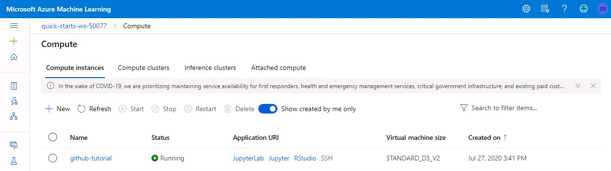
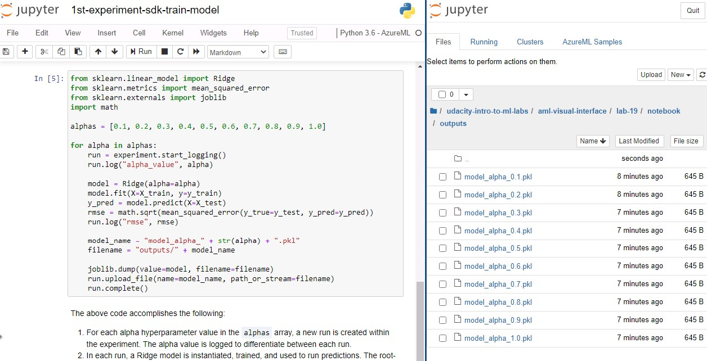
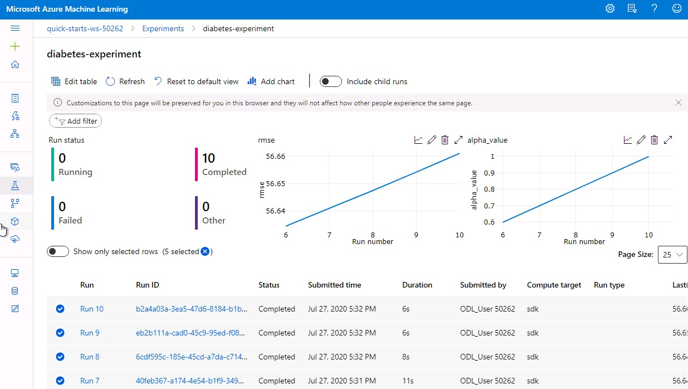
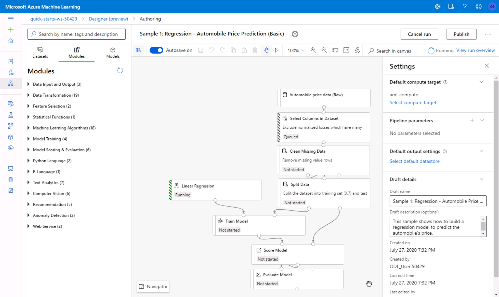
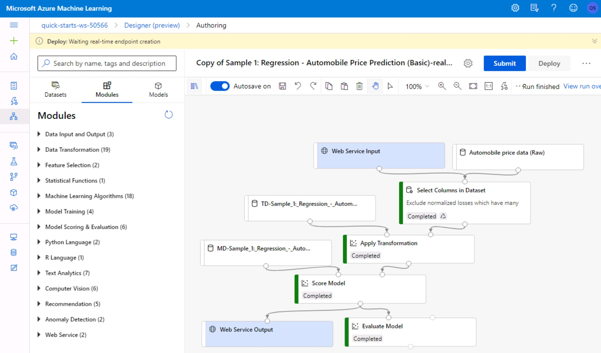
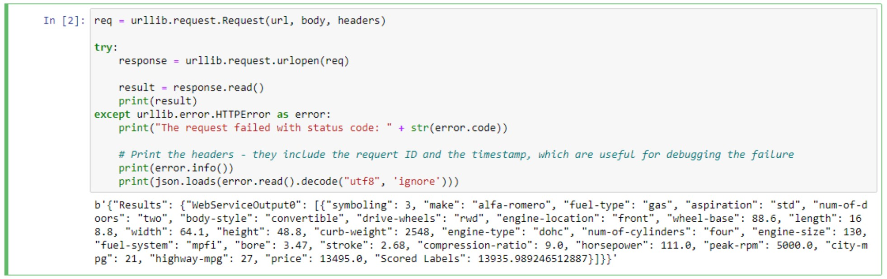

 

# Managed Services for Machine Learning
This repository is a summary of the content of lesson six of the *Introduction to Machine Learning on Azure* course which is part of the *Microsoft Scholarship Foundation course Nanodegree Program* on *Udacity* (July - September 2020).

As part of our role as student leaders, we will not only write this guide book, but also answer commonly asked question of the community. Furthermore, we will provide a list of resources to support your success in this course.

**You can do it!**

## Introduction

Managed services for Machine Learning can be used to *outsource* your local Machine Learning processes (Training, Inference and Notebook Testing) to the cloud. By using end-to-end automation via pipelines (DevOps for ML / MLOps), you can deploy to production environments easily. The examples in this lesson will use services provided by Azure Machine Learning.

In comparison to local development, you don't need to install any applications and libraries, as all this has been done already. You don't have to take care of the *low level* layers, so you can jump right in using your webbrowser!

Speaking of using your webbrowser, you might already know from the previous lessions, that you need to prelaunch your lab environment to get the scholarship account details. Visit [this page](https://classroom.udacity.com/nanodegrees/nd00332/parts/9e5002de-e740-4eb2-aa15-03861fff12fc/modules/ae74a72a-97c1-4306-b55e-708c58118bd2/lessons/ff14cb2c-d367-4f57-9f35-244fd1aceda2/concepts/0d9d532d-d0e3-4a76-bfa3-fd6630372628) and click on the blue *Prelaunch Lab* button before moving on.

## FAQ
[Click here to go the FAQ.](FAQ.md)

## Course Notes
[Click here to view the notes of this lesson](course_notes_priyanka_umre.pdf), written by [@PriyankaUmre](https://github.com/PriyankaUmre).

## Labs
In this section, you will find step-by-step introductions for each lab, so you can easily progress.
If there are any known errors in the original lab guide, corrections and workarounds are included in these steps.

### Lab 1 (6.5): Managing Compute Resources
In this lab, you will learn how to create a new compute resource, how to modify an existing one and how to stop, restart or delete it.

1. [Open Workspace](https://classroom.udacity.com/nanodegrees/nd00332/parts/9e5002de-e740-4eb2-aa15-03861fff12fc/modules/ae74a72a-97c1-4306-b55e-708c58118bd2/lessons/ff14cb2c-d367-4f57-9f35-244fd1aceda2/concepts/50fa8755-d4eb-413d-9b5d-6277671452b2)
2. Enter the *Studio* by clicking *Launch now* and select a subscription and workspace as mentioned in the lab guide.
3. Select *Compute* in the right menu.
4. Select the *Compute instances* tab.
5. Click on the *Create* button, choose a unique name of your choice and select a virtual machine from the dropdowns. For this lession, we will be using a CPU-based VM with size *Standard_D3_v2*.
6. Click on *Create* and wait a few seconds (took 8 minutes in my case) until the shown status changes to *Running*.
7. Select your compute resource in the list and click on its name to view details about the compute. You can also click on any of the buttons to stop, delete or restart the resource.
8. Go back to the list of computes and take a look at the *Application URI* column. By clicking on any of the links, a new browser tab with the respective development environment will be launched. 

### Lab 2 (6.9): Managed Notebook Environments
In this lab, you will learn how to train a simple SciKit learn model using a managed jupyter notebook environment.

1. [Open Workspace](https://classroom.udacity.com/nanodegrees/nd00332/parts/9e5002de-e740-4eb2-aa15-03861fff12fc/modules/ae74a72a-97c1-4306-b55e-708c58118bd2/lessons/ff14cb2c-d367-4f57-9f35-244fd1aceda2/concepts/d3b43f98-bd8b-4c5d-ba6d-c19cbdd5bfd0)
2. Open the *Studio* and navigate to the *Compute* list, just as you did in the last lab. Note that you won't need to create a new instance this time, as the workspace will already have one prepared for you.
3. In the *Application URI* column, click on the *Jupyter* link.
4. In Jupyter, open a terminal by clicking on *New* and *Terminal*
5. Download an example notebook by using `git clone https://github.com/solliancenet/udacity-intro-to-ml-labs.git`
6. From within the Jupyter interface, navigate to directory `udacity-intro-to-ml-labs/aml-visual-interface/lab-19/notebook` and open `1st-experiment-sdk-train-model.ipynb`.
7. Read through the notebook to get a quick overview
8. Select "Cell" and "Run All" ´, click on the login-link in the first cells output and then wait for the run to be completed. If the run stops after the login cell, even though you logged in, just click on "Run All" again.
9. in the directory `udacity-intro-to-ml-labs/aml-visual-interface/lab-19/notebook/outputs`, you will find the trained `.pkl` model file for each iteration (run).

10. *Optional:* Modify the notebook as you want and re-run code by clicking on "Kernel" and "Restart & Run All". 

### Lab 3 (6.13): Introduction to Experiments and Runs (Basic Modeling)
In this lab, you will learn how to create an experiment process and how to create and execute a run based on the experiment (which will train a model for you). We will also save the generated model to a model registry.

1. [Open Workspace](https://classroom.udacity.com/nanodegrees/nd00332/parts/9e5002de-e740-4eb2-aa15-03861fff12fc/modules/ae74a72a-97c1-4306-b55e-708c58118bd2/lessons/ff14cb2c-d367-4f57-9f35-244fd1aceda2/concepts/5cae4a97-abe3-4a05-be3e-6daf923427f4)
2. Open the *Jupyter Terminal* and download the git repository just as you did in the last lab.
3. From within the Jupyter interface, navigate to directory `udacity-intro-to-ml-labs/aml-visual-interface/lab-20/notebook` and open `1st-experiment-sdk-train-model.ipynb`.
4. Run all of the code and check if the output has been generated, just as you did in the last lab. The output directory will this time be `udacity-intro-to-ml-labs/aml-visual-interface/lab-20/notebook/outputs`.
5. Within Azure Machine Learning Studio, select *Experiments* in the left-hand menu, then select the *diabetes-experiment*, which is created by the notebook you just executed.
6. Take a look at the dashboard and view details about the experiment and its runs.

7. Add additional columns to the run list by clicking on *Edit table* and moving the *Start Time* and *End Time* entries to the right. Close the window using the *Save* button.
8. Click on one of the *Run IDs* to view information about a specific run. In the *Outputs + logs* tab, you should be able to see one of the outputs you previously saw inside the jupyter filebrowser. You can download the model if you like.

### Lab 4 (6.18): Deploy a Model as a Webservice (Advanced Modeling)
In this lab, you will learn how to create a ML pipeline including obtaining, importing and preparing data, building and training Models as well as deploying (=operationalizing) and predicting them. Such a MLOps integrated process will ensure model repoducibility, model validation, model deployment and model retraining.

A typical model deployment consists of:
1. getting the model file
2. creating a scoring script
3. in some cases creating a schema file describing the web service input 
4. creating a (real-time or batch) inference web service which can be called from your application
5. repeating the process for each time the model is retrained

These are the steps you need to do in the lab:
1. [Open Workspace](https://classroom.udacity.com/nanodegrees/nd00332/parts/9e5002de-e740-4eb2-aa15-03861fff12fc/modules/ae74a72a-97c1-4306-b55e-708c58118bd2/lessons/ff14cb2c-d367-4f57-9f35-244fd1aceda2/concepts/4ca28599-e40d-433d-9b4b-30f9f35a152d)
2. Open the *Studio* just as you did in the previos labs
3. Click on *Designer* in the left menu and create a new pipeline based on the *Sample 1: Regression - Automobile Price Prediction...* template.
4. In the now open *visual pipeline authoring editor* settings, click on *Select compute target* and chose the existing entry from the list. Then, click *Save* and *Submit*, to open a popup window.
5. In the *Set up pipeline run* popup, create a new experiment with a unique name of your choice.
6. Wait for the pipeline run to complete (~10min). In the top-right corner, you will see the status of your experiment. 

7. Create a new real-time inference pipeline using the top-right button
8. Click on the submit button, in the popup select your experiment and submit the popup. If you have trouble clicking the submit button, click the button to the right of the deploy button (three dots) and choose cloning. Once you clone, try again and the issue should be resolved.
9. Wait for the pipeline run to finish (~7 min) and then click on *Deploy*.
10. Deploy a new real-time endpoint using your existing compute target and wait for the deployment to complete. 

11. To view information about the deployed web service, select *Endpoints* in the left menu and then click on the name of your created real-time endpoint.
12. Change to the *Consume* tab to read the REST endpoint and authentification keys as well as code samples for calling the endpoint in C#, Python and R.
13. *Optional:* If you want, you can copy the python code to a new compute notebook and run it, to see if you can access the web service endpoint. 

### Lab 5 (6.22): Programmatically Accessing Managed Services
In this lab, you will use the Azure ML Python SDK to register, package, deploy and test a trained model from source code instead of the GUI you used before.

1. [Open Workspace](https://classroom.udacity.com/nanodegrees/nd00332/parts/9e5002de-e740-4eb2-aa15-03861fff12fc/modules/ae74a72a-97c1-4306-b55e-708c58118bd2/lessons/ff14cb2c-d367-4f57-9f35-244fd1aceda2/concepts/e327e325-dd3b-42b2-b1d7-b29397a5c765)
2. Open the *Studio* and open Jupyter from the *Compute* list, just as you did in the last labs.
3. Open a new Terminal in Jupyter and clone the example code using `git clone https://github.com/solliancenet/udacity-intro-to-ml-labs.git`.
4. From within the Jupyter interface, navigate to the directory `udacity-intro-to-ml-labs/aml-visual-interface/lab-22/notebook` and open `deployment-with-AML.ipynb`.
5. From your workspaces homepage (with the *Launch Now* button), copy the subsription id, resource group, workspace name and workspace region to the empty string variables in the jupyter notebook.

6. Read through and run all the notebook cells. The notebook will create a docker container that will be run as our webservice and then make calls to this webservice.
7. Check the *Studio* page, and you will see a new entry in the endpoints list.

## About
This guide was written by the student leaders of lesson six: Kuldeep Singh Sidhu (🇮🇳 [@singhsidhukuldeep](https://github.com/singhsidhukuldeep)), Ramkrishna Kundu (🇮🇳 [@ramkundu](https://github.com/ramkundu)) and Alexander Melde (🇩🇪 [@AlexanderMelde](https://github.com/AlexanderMelde/)).

### Contributing
Feel free to send pull requests or open an issue if you have any questions.

All commit messages should follow the [Udacity Git Commit Message Style Guide](https://udacity.github.io/git-styleguide/).

### License
The content of this repository is released under the [MIT license](LICENSE).
